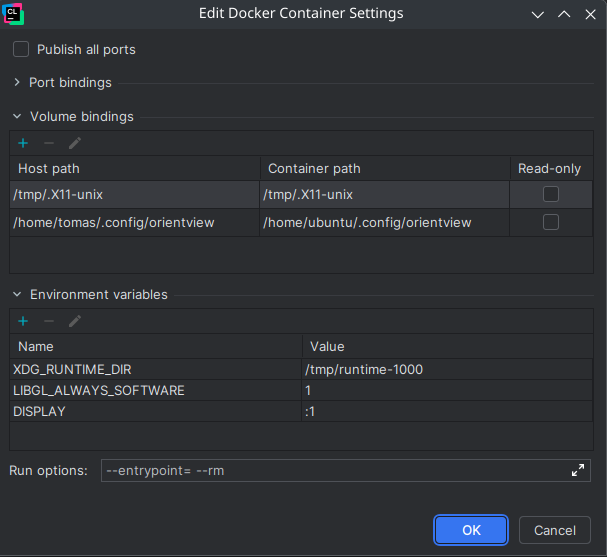

# Clion

Here I will describe how to set up Jetbrains CLion IDE for the project to have integration and debugging.

## 1. Build the building docker image

Follow steps in [build.md](build.md).

## 2. Build the orientview-clion docker image

This docker image includes everything needed to compile, debug and run the project as well as headers and libraries for X11 to connect to your host.

In the `misc/linux` directory, run:`docker build -t orientview-clion -f clion.Dockerfile .`

## 3. Setup Docker toolchain inside Clion

1. Go to `File -> Settings -> Build, Execution, Deployment -> Toolchains`
2. Click `Add` (plus symbol)
3. Select Docker
4. Select the previously built `orientview-dev-env` image
5. In `Container settings` click the triple dot button.
6. Add a volume: Host path: `/tmp/.X11-unix` Container path: `/tmp/.X11-unix`
7. You can additionally mount the orientview config file: Host path: `/home/<user>/.config/orientview` Container path: `/home/ubuntu/.config/orientview`
8. Add these environment variables: `DISPLAY=:1`, `XDG_RUNTIME_DIR=/tmp/runtime-1000`, `LIBGL_ALWAYS_SOFTWARE=1`
9. Set run options to `--entrypoint= --rm`

## 4. Use the Docker toolchain

1. Go to `File -> Settings -> Build, Execution, Deployment -> CMake`
2. Choose your CMake profile or make a new one
3. Set the toolchain to the Docker toolchain you created

## 4. Allow docker to connect to X11

This needs to be done for each session (after restarting the computer)

1. Run `xhost +local:docker`